## Task

> [State Historical Museum](https://shm.ru) seeks to develop a sustainable methodology 
> for digitizing its collection of unique historical artefacts and surveying its buildings.
> This pilot project includes creating of digital replicas of two unique objects from SHM collection
> and 3D models of separate spaces in the Pokrovsky Cathedral.

## 3D Scanning and Image Capture Process

We have found that using only photo camera or only a 3D scanner does not lead to satisfactory results and decided to combine accurate 3D geometry captured by the laser scanner and high-quality, high-resolution images acquired by a DSLR camera.

Photo capture process was implemented by configuring Canon EOS 60D DSLR for stationary capture.
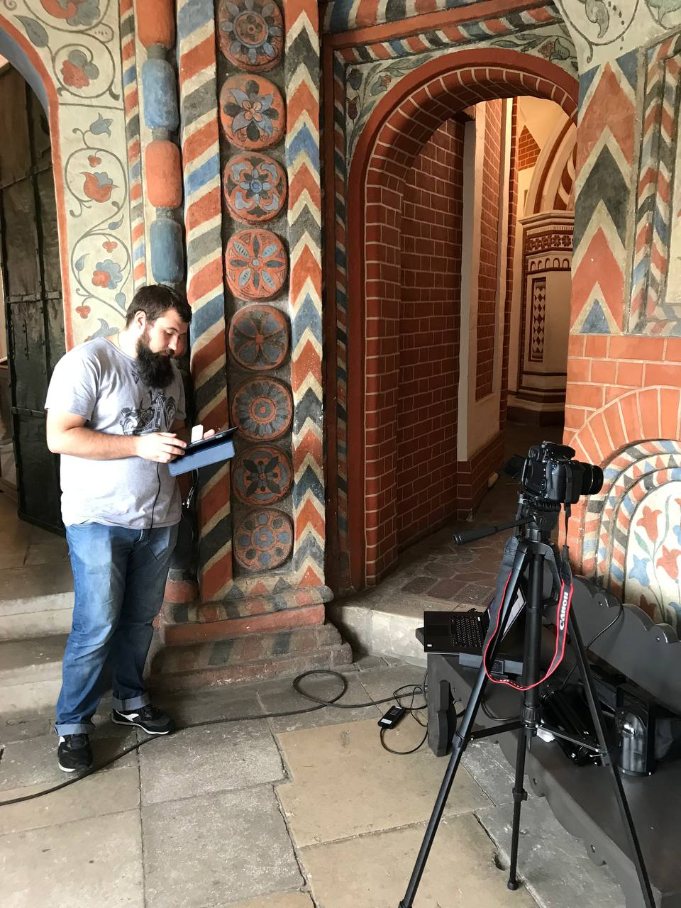

The photos acquired by Canon EOS 60D DSLR were used to reconstruct a 3D model of the Western Gallery in the Pokrovsky Cathedral (click to enlarge).

<a href="images/1_real.jpg">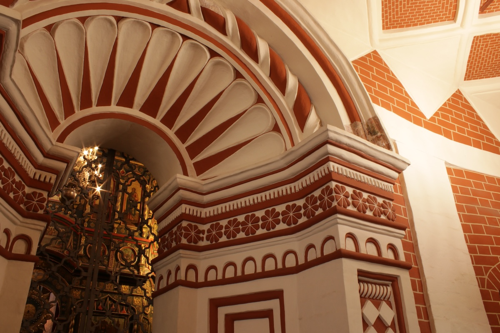</a>
<a href="images/2_real.jpg">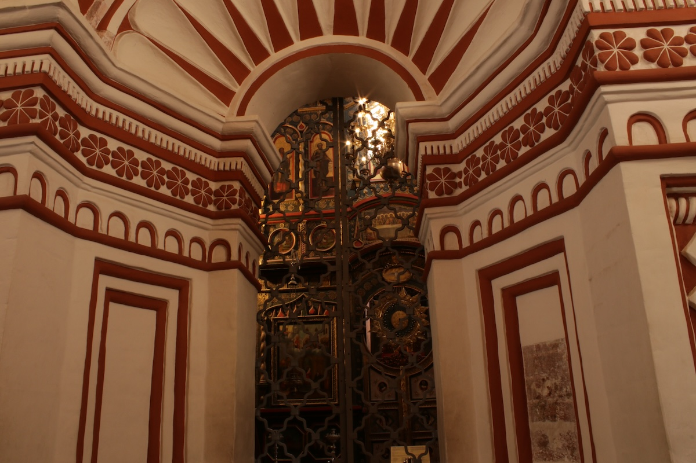</a>
<a href="images/3_real.jpg">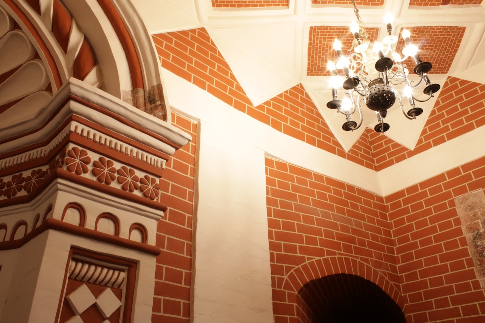</a>
<a href="images/4_real.jpg">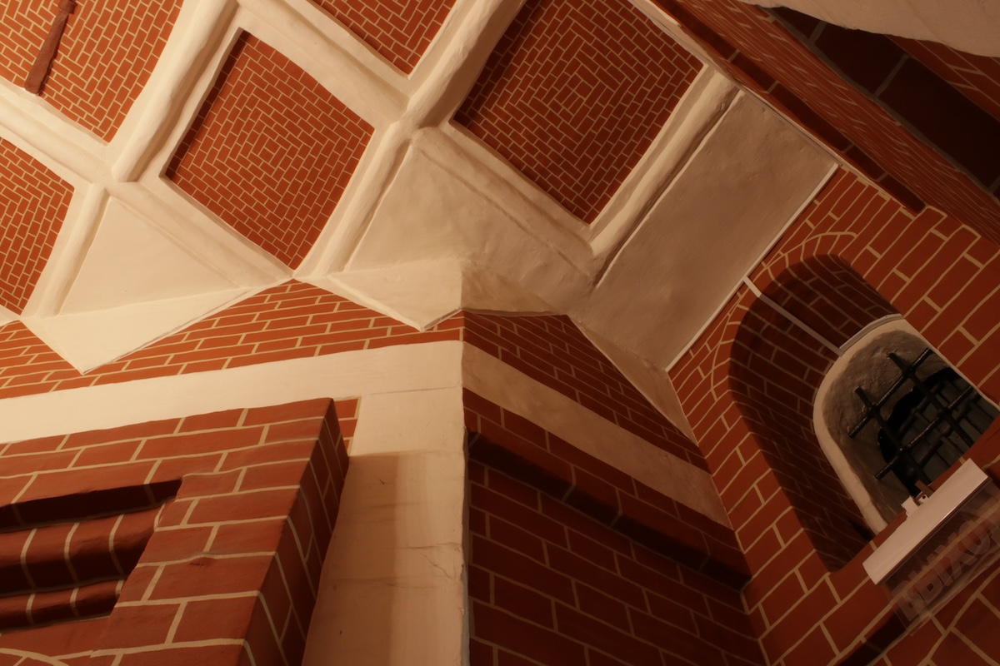</a>
<a href="images/5_real.jpg">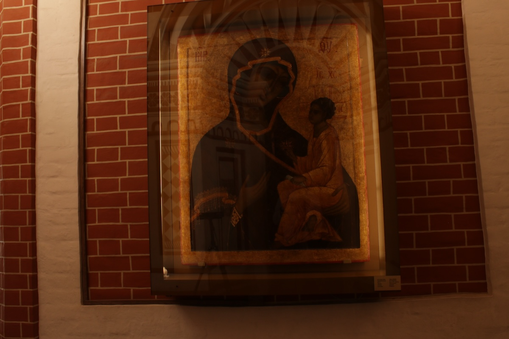</a>

A different gallery in the cathedral was acquired by Sony A7IV camera mounted on an automatic turning device.



3D scanning of room-size spaces was performed by Leica BLK360 laser scanner. 
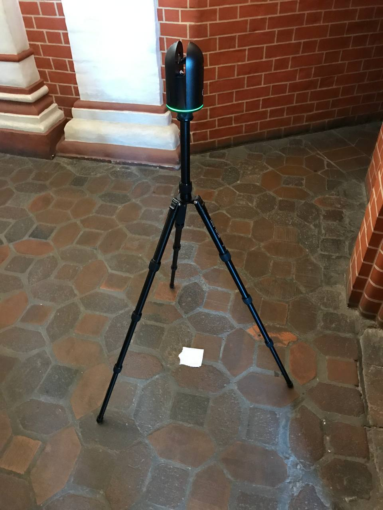



For smaller objects, we have also used a hand-held Artek Space Spider structured-light 3D scanner.



## 3D Models of Museum Spaces

The resulting reconstructions of the Western Gallery of the Pokrovsky Cathedral come in the form of textured meshes.
We perform post-reconstruction optimization to refine texture of the 3D models. 

**Left:** no optimization; **Right:** with optimization.



We separately present textured visualizations and geometry renders.

| Textured 3D model | Geometry render |
|-|-|
|  |  |
{.video-gallery}

For comparison with real images captured by our DSLR, we present high-res renders taken from the textured 3D models (click to enlarge).

<a href="images/1_render.jpg">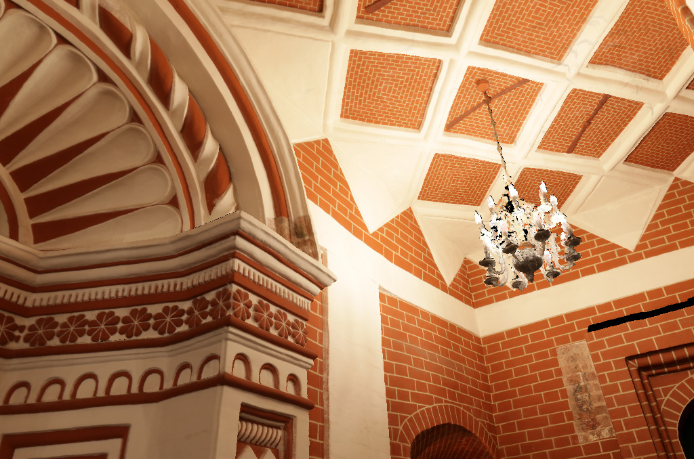</a>
<a href="images/2_render.jpg">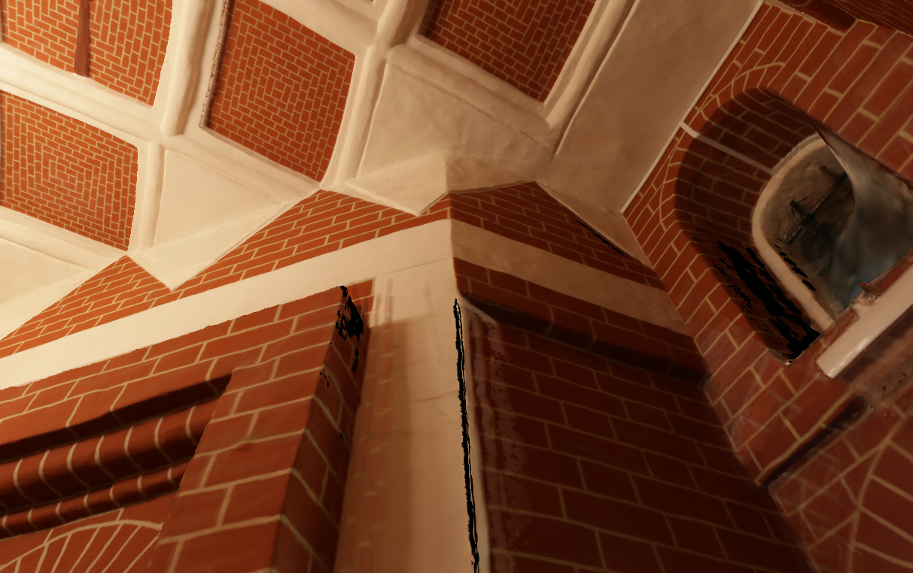</a>
<a href="images/3_render.jpg">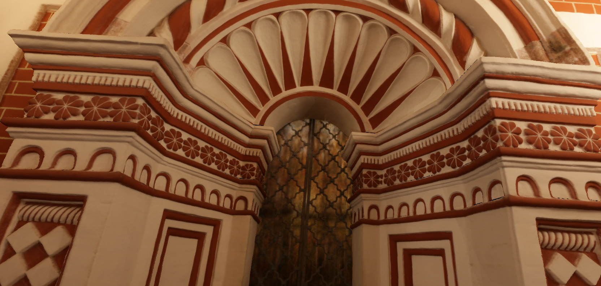</a>
<a href="images/4_render.jpg">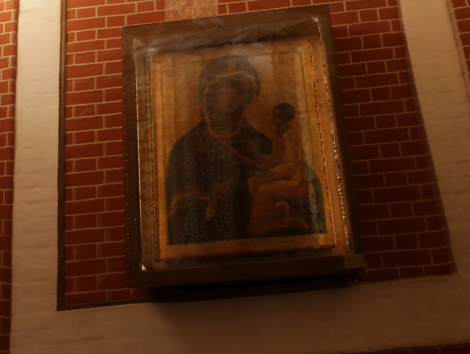</a>
<a href="images/5_render.jpg">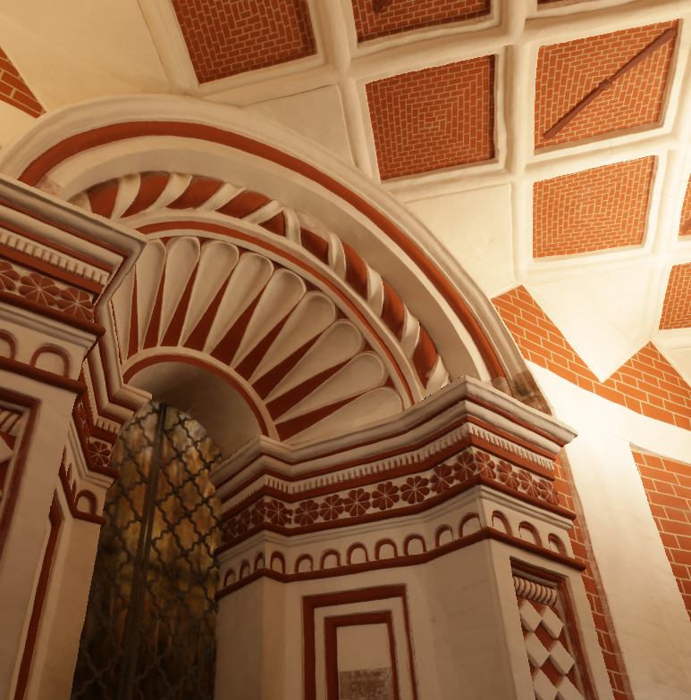</a>

## 3D Replicas of Museum Exhibits

We present 3D recontructions of important museum exhibits. 

The Book of Gospels (1692) ([click here for high-res video](https://www.dropbox.com/scl/fi/y755tali4ahn5w1e4cf4c/book.mp4?rlkey=vp5o9vqrwm32fyz1zj6si2g0t&dl=0)).



The ceramic voice resonator jug (Russian: голосник) from the Church of the Three Patriarchs (mid-17th century) ([click here for high-res video](https://www.dropbox.com/scl/fi/yi90y037nob4lwbglcwme/golosnik.mp4?rlkey=0t7pls67ne8hmmdldqmwmkc9v&dl=0)).



## Video Report (in Russian)



## The Team

 * **Museum manager (SHM):** Tatyana Saracheva
 * **Data acquisition (Skoltech):** Saveliy Galochkin, Arseniy Bozhenko, Pavel Karpyshev, Timofey Glukhikh
 * **Data processing and 3D reconstruction (Skoltech):** Oleg Voynov, Saveliy Galochkin
 * **Project managers (Skoltech):** Alexey Artemov, Evgeny Burnaev

